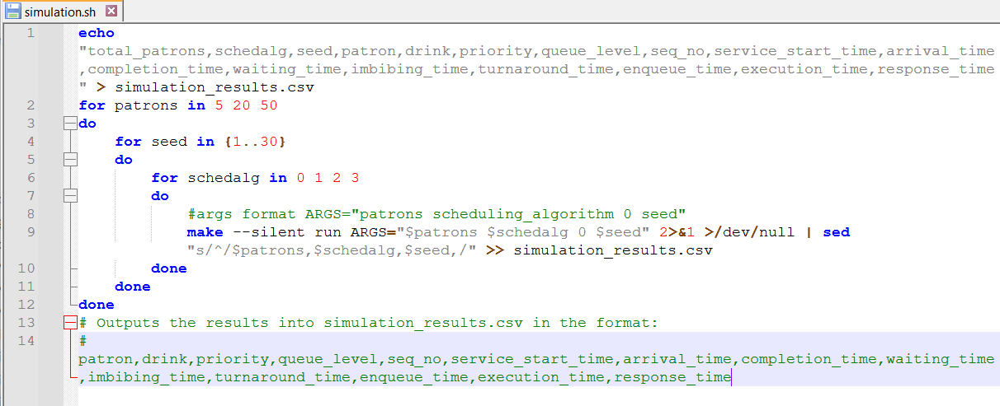

```{r, include=FALSE}
pkg_vec <- c("ggplot2","ggthemes","ggh4x","broom","kableExtra","tidyr","tidyverse","emmeans","effectsize","car","dplyr")
for (x in pkg_vec) {
  if (!requireNamespace(x, quietly = TRUE)) {
    install.packages(x, dependencies = TRUE)
  }
  library(x, character.only = TRUE)
}

```

# Introduction

Allegra the barman is an abstraction of the low-level workings of a CPU. The study of CPU scheduling algorithms can be likened much to the analogy of a barman serving drinks at a bar, where each patron (customer) is a process and each of their drink orders is a CPU burst. In this analogy, Allegra the barman acts as the CPU and her method of serving patrons is a scheduling algorithm. This provides us with a real world example of what CPU scheduling algorithms do and what these algorithms aim to achieve.

The CPU scheduling algorithms that will be tested within this analogy are First-Come First-Serve (FCFS), Shortest Job First (SJF), Priority, and Multilevel Feedback Queue (MLFQ). We are provided the information that none of the algorithms use pre-emption at the level of the individual drink order.

We will evaluate the overall success of the algorithms by comparing their performances with respect to the response and waiting times (both per order, and the total per patron), and turnaround time, as well as throughput, predictability, fairness, and possibility of starvation.

The goal of this assignment is to determine the CPU scheduling algorithm that, when applied to the bar setting, is to satisfy the bar owner. 

In order to achieve maximum satisfaction, we need to serve as many customers in the shortest time frame (throughput), while at the same time, ensuring that all customers feel fairly treated such that they will, on average, have the best experience. Taking both of these things into account will help maximise nightly profit, while encouraging consequent visits, hopefully providing longer term success to the bar.

# Methods

One of the most important steps in the experimental process is creating valid and reliable data in a repeatable way. This process can be broken down into steps to first generate the data, and second validate the data.

## Method of data generation

To generate reliable and repeatable data we need to define, in context, what this would mean. For our results to be reliable we must first ensure that we fairly test each algorithm. We can do this by having simulations for each algorithm run with the same `seed`, `sleep_time`, `total_patrons` configuration.

`sleep_time` describes to the Java program the resting time of the barman before processing the next order, which in this scenario is unnecessary, so we set it to 0.

We need a range of different `total_patrons` to test these algorithms under different workloads. The values of 5, 20, and 50 have been chosen for this experiment.

According to the Central Limit Theorem, the minimum number of unique simulations required to model their distributions is 30. Meaning that we will need to test every scheduling algorithm 30 times for each value of `total_patrons`. To do this we can loop through seeds 1 to 30 for each `scheduling_algorithm`, `total_patrons` pairing.

We created a bash script @fig-bash[simulation.sh] to run through this repeated simulation process.

We need to also ensure that the generated data is in a suitable format for analysing. This was done by completing the `recordCompletedOrder` function in `Barman.java` to print all of the *per-order metrics* that the barman class provided in the format "*patron,drink,priority,queue_level,seq_no,service_start_time,arrival_time,completion_time,waiting_time,imbibing_time,turnaround_time,enqueue_time,execution_time,response_time*." This output prints this for every completed drink order into the error console. We retrieve only the error console output of the application by calling `2>&1 ./dev/null` after the call of the `make` function.

But before we save the metrics in a `.csv` file, we need to attach the individual simulation configuration "`total_patrons`,`schedalg`,`seed`," to the start of each line in the error console. This is done by `sed "s/^/$patrons,$schedalg,$seed,/"`. The final outputs are appended to `simulation.csv`.

By running our bash script, our generation of repeatable and reliable data is complete.

{#fig-bash}

## Method of data validation

```{r, include=FALSE}
df = read_csv("simulation_results.csv")
df$total_patrons = factor(df$total_patrons)
df$schedalg = factor(df$schedalg, levels = c(0, 1, 2, 3), labels = c("FCFS", "SJF", "Priority", "MLFQ"))
df$drink = factor(df$drink)
df$priority = factor(df$priority)
df$queue_level = factor(df$queue_level)
```

*The exact code/methods used to obtain results in the section can be found in `MRRCON006 Final Report.qmd`.*

To validate the data and code for the analysis of the algorithms, we need to ensure that

**(a)** the data is complete, **(b)** the data follows the basic CPU scheduling rules, and **(c)** the data produced identical workloads for each algorithm across seeds.

### (a) Data completeness

We check that the correct amount of simulations was run and that there were no missing values

```{r, echo=FALSE}
# Check for expected number of observations
expected_combinations <- df %>%
  group_by(total_patrons, schedalg) %>%
  summarise(seeds_count = n_distinct(seed), .groups = 'drop')

cat("Validation: Seeds per workload/algorithm combination:\n")
kable(expected_combinations)

# Check for missing values (NAs)
cat("Number of missing values:",sum(colSums(is.na(df))),"\n")
```

Which correctly matches what we expect to see.

### (b) Code and data is logically correct

To test this we check whether all $Turnaround \geq Waiting + Execution$, and $Response \leq Waiting$. If there are 0 logic errors, then the code used and data generated is valid.

```{r, echo=FALSE}
# Logical Consistency Check: Turnaround Time
# Turnaround = Completion - Arrival. It must also be >= Waiting + Execution
logic_check <- df %>%
  mutate(logic_error = turnaround_time < (waiting_time + execution_time)) %>%
  filter(logic_error == TRUE)

if(nrow(logic_check) == 0) {
  cat("0 exceptions, Validation Passed: Turnaround times are logically consistent.\n")
} else {
  print("Validation Failed: Found logical errors in turnaround calculations.")
}

# Response Time Check
# Response time should never be greater than Waiting Time
response_check <- df %>%
  filter(response_time > waiting_time)

if(nrow(response_check) == 0) {
  cat("0 exceptions, Validation Passed: Response time is always <= total waiting time.\n")
}

```

### (c) Are the workloads identical across algorithms for the same seed

We tested whether the each algorithm had and identical total and type of drinks for the same `seed`, `total_patrons` pairing. This confirms that our simulation script provides valid, repeatable and reliable data.

```{r, echo=FALSE}
# Verify that the 'Workload' (drinks ordered) was identical across algorithms for the same seed
workload_validation <- df %>%
  group_by(total_patrons, seed, patron) %>%
  summarise(drink_count = n(), 
            unique_algs = n_distinct(schedalg), .groups = 'drop')

# If unique_algs == 4 for every patron/seed, then the workload was perfectly reproducible
if(sum(workload_validation$unique_algs) == 4*count(workload_validation)) {cat("Passed! The workload produced was identical across algorithms for a given seed")} else {cat("Failed")}
```

# Results and Analysis

## Per-Order metrics

What does this mean in terms of the bar and CPU scheduling

### Response time

```{r, echo=FALSE}
#| label: fig-order-response
#| fig-cap: "Boxplots of Per-Order Response Times"


ggplot(df, aes(x=schedalg, y=response_time, fill=schedalg)) +
  geom_boxplot() +
  facet_wrap(~total_patrons, scales = "free") +
  stat_summary(fun = mean, geom = "point", shape = 18, size = 3, color = "red")+
  labs(title="Per-Order Response Time Distribution by Algorithm (with mean)")
```

As seen in @fig-order-response.


### Waiting time

```{r, echo=FALSE}
#| label: fig-order-waiting
#| fig-cap: "Boxplots of Per-Order Waiting Times"

ggplot(df, aes(x=schedalg, y=waiting_time, fill=schedalg)) +
  geom_boxplot() +
  facet_wrap(~total_patrons, scales = "free") +
  stat_summary(fun = mean, geom = "point", shape = 18, size = 3, color = "red")+
  labs(title="Per-Order Waiting Time Distribution by Algorithm (with mean)")
```

As seen in @fig-order-waiting

## Per-Patron metrics

What does this mean in terms of the bar and CPU scheduling

### Response and waiting time

```{r, echo=FALSE}
#| label: fig-patron-response
#| fig-cap: "Boxplots of Per-Patron Response Times"

# Patron response time code block
response_df <- df %>%
  # patron-level grouping
  group_by(total_patrons, schedalg, seed, patron) %>%
  # Filter for only the very first order they placed
  filter(arrival_time == min(arrival_time)) %>%
  # Calculate response time for that specific first order
  summarise(patron_response_time = completion_time - execution_time - arrival_time,
    .groups = 'drop')

ggplot(response_df, aes(x=schedalg, y=patron_response_time, fill=schedalg)) +
  geom_boxplot() +
  facet_wrap(~total_patrons, scales = "free") +
  stat_summary(fun = mean, geom = "point", shape = 18, size = 3, color = "red")+
  labs(title="Per-Patron Response Time Distribution by Algorithm (with mean)")
```


```{r, echo=FALSE}
#| label: fig-patron-waiting
#| fig-cap: "Boxplots of Per-Patron Waiting Times"

# Patron Waiting time code block
patron_df <- df %>% # Using the patron-level data to see the spread of Turnaround and Waiting Times
  group_by(total_patrons, schedalg, seed, patron) %>%
  summarise(turnaround = max(completion_time) - min(arrival_time), total_wait = sum(waiting_time), .groups = 'drop')

ggplot(patron_df, aes(x=schedalg, y=total_wait, fill=schedalg)) +
  geom_boxplot() +
  facet_wrap(~total_patrons, scales = "free") +
  stat_summary(fun = mean, geom = "point", shape = 18, size = 3, color = "red")+
  labs(title="Per-Patron Waiting Time Distribution by Algorithm (with mean)")
```

We now analyse these figures.

### Turnaround time

```{r, echo=FALSE}
#| label: fig-turnaround
#| fig-cap: "Boxplots of Turnaround Times"

# Patron turnaround code block
ggplot(patron_df, aes(x = schedalg, y = turnaround, fill = schedalg)) +
  geom_boxplot() +
  facet_wrap(~total_patrons, scales = "free") +
  stat_summary(fun = mean, geom = "point", shape = 18, size = 3, color = "red") +
  labs(title = "Turnaround Time Spread (with mean)",
       y = "Turnaround Time (ms)", x = "Algorithm")
```

The turnaround time.

## Throughput

```{r,echo=FALSE}
#| label: fig-throughput
#| fig-cap: "Relative Throughputs compared to FCFS"

# Throughput code block
throughput_df <- df %>%
  group_by(total_patrons, schedalg,seed) %>%
  summarise(throughput = n() / (max(completion_time) - min(arrival_time)), .groups = 'drop')

avg_throughput_df <- throughput_df %>% group_by(total_patrons, schedalg) %>% summarise(avg_throughput = mean(throughput), .groups = 'drop')

relative_throughput <- avg_throughput_df %>%
  group_by(total_patrons) %>%
  mutate(fcfs_val = avg_throughput[schedalg == "FCFS"],
         relative_perf = avg_throughput / fcfs_val) %>%
  ungroup()

ggplot(relative_throughput, aes(x = as.factor(total_patrons), y = relative_perf, fill = schedalg)) +
  geom_col(position = "dodge") +
  geom_hline(yintercept = 1, linetype = "dashed", color = "red") + # Baseline
  coord_cartesian(ylim = c(0.98, 1.02)) +
  labs(title = "Throughput Relative to FCFS",
       subtitle = "Values > 1.0 indicate better performance than FCFS",
       x = "Total Patrons",
       y = "Relative Throughput (FCFS = 1.0)",
       fill = "Algorithm")
```

The throughput results.

## Fairness and Predictability

```{r, echo=FALSE}
#| label: fig-fairness
#| fig-cap: "Trendlines of Total Waiting Time vs No. of Drinks Ordered"

# Fairness (and predictability) code block

# Calculate total wait and order size per patron
fairness_df <- df %>%
  group_by(total_patrons, schedalg, seed, patron) %>%
  summarise(total_wait = sum(waiting_time), 
            drinks_ordered = n(), .groups = 'drop')

ggplot(fairness_df, aes(x = drinks_ordered, y = total_wait, color = schedalg)) +
  geom_smooth(method = "loess", se = TRUE, formula = y ~ x) + # Adds a trend line
  facet_wrap(~total_patrons, scales = "free") +
  labs(title = "Fairness: Total Wait Time vs. No. of Drinks Ordered",
       x = "Number of Drinks Ordered", y = "Total Patron Wait (ms)")
```

The fairness of the algorithms.

```{r, echo=FALSE}
#| label: fig-predictability 
#| fig-cap: "Predictability Score for Patron Waiting Time"

# Predictability code block
predictability_df <- fairness_df %>%
  group_by(total_patrons, schedalg) %>%
  summarise(CV = sd(total_wait) / mean(total_wait), .groups = 'drop')

ggplot(predictability_df, aes(x = schedalg, y = CV, fill = schedalg)) +
  geom_col() +
  facet_wrap(~total_patrons) +
  labs(title = "Predictability Score (Lower is Better)",
       subtitle = "Coefficient of Variation of Patron Waiting Time",
       y = "CV (Index of Unpredictability)")
```

Predictability of the algorithms.

## Possibility of starvation

As evident in @fig-order-waiting.

# Conclusions and Recommendations


