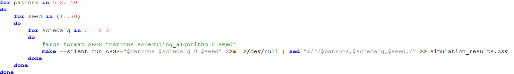

```{r, include=FALSE}
pkg_vec <- c("ggplot2","ggthemes","ggh4x","broom","kableExtra","tidyr","tidyverse","emmeans","effectsize","car","dplyr")
for (x in pkg_vec) {
  if (!requireNamespace(x, quietly = TRUE)) {
    install.packages(x, dependencies = TRUE)
  }
  library(x, character.only = TRUE)
}

```

# Introduction

Allegra the barman is an abstraction of the low-level workings of a CPU. The study of CPU scheduling algorithms can be likened much to the analogy of a barman serving drinks at a bar, where each patron (customer) is a process and each of their drink orders is a CPU burst. In this analogy, Allegra the barman acts as the CPU and her method of serving patrons is a scheduling algorithm. This provides us with a real world example of what CPU scheduling algorithms do and what these algorithms aim to achieve.

The CPU scheduling algorithms that will be tested within this analogy are First-Come First-Serve (FCFS), Shortest Job First (SJF), Priority, and Multilevel Feedback Queue (MLFQ). We are provided the information that none of the algorithms use pre-emption at the level of the individual drink order.

We will evaluate the overall success of the algorithms by comparing their performances with respect to the response and waiting times (both per order, and the total per patron), and turnaround time, as well as throughput, predictability, fairness, and possibility of starvation.

The goal of this assignment is to determine the CPU scheduling algorithm that, when applied to the bar setting, is to satisfy the bar owner. 

In order to achieve maximum satisfaction, we need to serve as many customers in the shortest time frame (throughput), while at the same time, ensuring that all customers feel fairly treated such that they will, on average, have the best experience.

Taking both of these things into account will help maximise nightly profit, while encouraging consequent visits, hopefully providing longer term success to the bar.

# Methods

One of the most important steps in the experimental process is creating valid and reliable data in a repeatable way. This process can be broken down into steps to first generate the data, and second, validate the data.

{width=100%}


## Method of data generation

We need to guarantee that every algorithm gets tested in the exact same circumstances. To ensure the reliability of the results, we must include multiple repetitions for each (total_patrons, scheduling_algorithm) combination. For the assumption of normality, according to the central limit theorem, it is a minimum requirement to have 30 observations per scenario. The java code given ensures that for some seed, the number of orders and the arrival time of the patrons remains constant. So we can loop from seed (1 to 30) to guaranteed unique

To ensure that we fairly tested each algorithm

To generate this data for the analysis of the scheduling algorithms, the following steps were taken.

 - Complete the `recordCompletedOrder` function in `Barman.java` to print all of the per order metrics that the barman class provided in the format "patron,drink,priority,queue_level,seq_no,service_start_time,arrival_time,completion_time,waiting_time,imbibing_time,turnaround_time,enqueue_time,execution_time,response_time"

 - Create a bash script that loops through

```{r, include=FALSE}
df = read_csv("simulation_results.csv")
df$total_patrons = factor(df$total_patrons)
df$schedalg = factor(df$schedalg, levels = c(0, 1, 2, 3), labels = c("FCFS", "SJF", "Priority", "MLFQ"))
df$drink = factor(df$drink)
df$priority = factor(df$priority)
df$queue_level = factor(df$queue_level)
```

## Method of data validation

To validate the data and code for the analysis of the algorithms, we need to ensure that

**(a)** the data is complete, **(b)** the data follows the basic CPU scheduling rules, and **(c)** the data produced identical workloads for each algorithm across seeds.

### (a) Data completeness

We check that the correct amount of simulations was run and that there were no missing values

```{r, echo=FALSE}
# Check for expected number of observations
expected_combinations <- df %>%
  group_by(total_patrons, schedalg) %>%
  summarise(seeds_count = n_distinct(seed), .groups = 'drop')

cat("Validation: Seeds per workload/algorithm combination:\n")
kable(expected_combinations)

# Check for missing values (NAs)
cat("Number of missing values:",sum(colSums(is.na(df))),"\n")
```

Which correctly matches what we expect to see.

### (b) Code and data is logically correct

To test this we check whether all Turnaround \>= Waiting + Execution, and Response \<= Waiting. If there are 0 logic errors, then that shows that the code and data generated is valid.

```{r, echo=FALSE}
# Logical Consistency Check: Turnaround Time
# Turnaround = Completion - Arrival. It must also be >= Waiting + Execution
logic_check <- df %>%
  mutate(logic_error = turnaround_time < (waiting_time + execution_time)) %>%
  filter(logic_error == TRUE)

if(nrow(logic_check) == 0) {
  cat("0 exceptions, Validation Passed: Turnaround times are logically consistent.\n")
} else {
  print("Validation Failed: Found logical errors in turnaround calculations.")
}

# Response Time Check
# Response time should never be greater than Waiting Time
response_check <- df %>%
  filter(response_time > waiting_time)

if(nrow(response_check) == 0) {
  cat("0 exceptions, Validation Passed: Response time is always <= total waiting time.\n")
}

```

### (c) Are the workloads identical across algorithms for the same seed

We tested whether the each algorithm had and identical total and type of drinks for the same seed, total_patrons pairing.

```{r, echo=FALSE}
# Verify that the 'Workload' (drinks ordered) was identical across algorithms for the same seed
workload_validation <- df %>%
  group_by(total_patrons, seed, patron) %>%
  summarise(drink_count = n(), 
            unique_algs = n_distinct(schedalg), .groups = 'drop')

# If unique_algs == 4 for every patron/seed, then the workload was perfectly reproducible
if(sum(workload_validation$unique_algs) == 4*count(workload_validation)) {cat("Passed! The workload produced was identical across algorithms for a given seed")} else {cat("Failed")}
```

# Results and Analysis

## Per-Order metrics

What does this mean in terms of the bar and CPU scheduling

### Response time

### Waiting time

## Per-Patron metrics

What does this mean in terms of the bar and CPU scheduling

### Response and waiting time

### Turnaround time

### Throughput

### Predictability

### Fairness

### Possibility of starvation

```{r}
ggplot(df, aes(x=schedalg, y=waiting_time, fill=schedalg)) +
  geom_boxplot() +
  facet_wrap(~total_patrons, scales = "free") +
  stat_summary(fun = mean, geom = "point", shape = 18, size = 3, color = "red")+
  labs(title="Per-Order Waiting Time Distribution by Algorithm (with mean)")

ggplot(df, aes(x=schedalg, y=response_time, fill=schedalg)) +
  geom_boxplot() +
  facet_wrap(~total_patrons, scales = "free") +
  stat_summary(fun = mean, geom = "point", shape = 18, size = 3, color = "red")+
  labs(title="Per-Order Response Time Distribution by Algorithm (with mean)")
```

# Conclusions and Recommendations

```{r}
# Using the patron-level data to see the spread of Turnaround Times
patron_df <- df %>%
  group_by(total_patrons, schedalg, seed, patron) %>%
  summarise(turnaround = max(completion_time) - min(arrival_time), total_wait = sum(waiting_time), .groups = 'drop')

ggplot(patron_df, aes(x=schedalg, y=total_wait, fill=schedalg)) +
  geom_boxplot() +
  facet_wrap(~total_patrons, scales = "free") +
  stat_summary(fun = mean, geom = "point", shape = 18, size = 3, color = "red")+
  labs(title="Per-Patron Waiting Time Distribution by Algorithm (with mean)")

response_df <- df %>%
  group_by(total_patrons, schedalg, seed, patron) %>%
  # Filter for only the very first order they placed
  filter(arrival_time == min(arrival_time)) %>%
  # Calculate response time for that specific first order
  summarise(patron_response_time = completion_time - execution_time - arrival_time,
    .groups = 'drop')

ggplot(response_df, aes(x=schedalg, y=patron_response_time, fill=schedalg)) +
  geom_boxplot() +
  facet_wrap(~total_patrons, scales = "free") +
  stat_summary(fun = mean, geom = "point", shape = 18, size = 3, color = "red")+
  labs(title="Per-Patron Response Time Distribution by Algorithm (with mean)")


ggplot(patron_df, aes(x = schedalg, y = turnaround, fill = schedalg)) +
  geom_boxplot() +
  facet_wrap(~total_patrons, scales = "free") +
  stat_summary(fun = mean, geom = "point", shape = 18, size = 3, color = "red") +
  labs(title = "Turnaround Time Spread (with mean)",
       y = "Turnaround Time (ms)", x = "Algorithm")
```

```{r}
# Calculate total wait and order size per patron
fairness_df <- df %>%
  group_by(total_patrons, schedalg, seed, patron) %>%
  summarise(total_wait = sum(waiting_time), 
            order_size = n(), .groups = 'drop')

ggplot(fairness_df, aes(x = order_size, y = total_wait, color = schedalg)) +
  geom_smooth(method = "loess", se = TRUE, formula = y ~ x) + # Adds a trend line
  facet_wrap(~total_patrons, scales = "free") +
  labs(title = "Fairness: Total Wait Time vs. Order Size",
       x = "Number of Drinks Ordered", y = "Total Patron Wait (ms)")
```

```{r}
predictability_df <- fairness_df %>%
  group_by(total_patrons, schedalg) %>%
  summarise(CV = sd(total_wait) / mean(total_wait), .groups = 'drop')

ggplot(predictability_df, aes(x = schedalg, y = CV, fill = schedalg)) +
  geom_col() +
  facet_wrap(~total_patrons) +
  labs(title = "Predictability Score (Lower is Better)",
       subtitle = "Coefficient of Variation of Patron Waiting Time",
       y = "CV (Index of Unpredictability)")
```

```{r}
throughput_df <- df %>%
  group_by(total_patrons, schedalg,seed) %>%
  summarise(throughput = n() / (max(completion_time) - min(arrival_time)), .groups = 'drop')

avg_throughput_df <- throughput_df %>% group_by(total_patrons, schedalg) %>% summarise(avg_throughput = mean(throughput), .groups = 'drop')

ggplot(avg_throughput_df, aes(x = total_patrons, y = avg_throughput, fill = schedalg)) +
  geom_col(position = "dodge") +
  labs(title = "Throughput Efficiency Ranking by Workload",
       x = "Total Patrons",
       y = "Average Throughput (Patrons/ms)",
       fill = "Algorithm")
```
